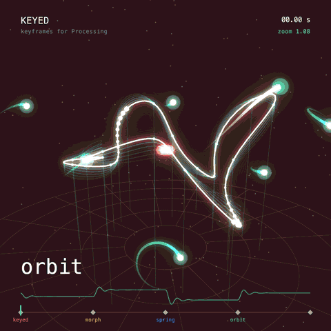

# Keyed

**Keyframe animation for Processing.**

Keyed brings keyframes to your sketches. Set a value at a few points in time, and Keyed blends everything in between, with easing, paths, effects and events.

Using p5.js? There is also [p5.keyed](https://github.com/domizai/p5.keyed), the same library for p5.js.

{ .sketch }

```java
import ch.domizai.keyed.*;

Keyed<Float> x;

void setup() {
    size(400, 400);
    Keyed.init(this).setDuration(2);

    x = Keyed.ofFloat()
        .key(0, 50f)
        .key(1, 350f)
        .key(2, 50f);
}

void draw() {
    background(255);
    circle(x.value(), height / 2, 40);
}
```

## Features

- **Any type:** floats, ints, colors, `PVector`, `String`, `boolean`, quaternions, shapes, or your own classes.
- **Easing:** After Effects style influence, the usual presets, CSS-like `cubicBezier()`, steps, or any function.
- **Timelines:** loop, play once, pause, scrub, change speed, play backwards, or run several clocks side by side.
- **Events:** markers and loop/finish callbacks.
- **Binding:** let Keyed write animated values straight into your fields.
- **Paths:** move along Béziers, splines and chained curves, in 2D or 3D.
- **Effects:** wiggle, orbit, spring, lag, stop motion, grid snap, motion trails, or your own.
- **Export:** frame-exact timing for `saveFrame()`.

## Tutorial

The tutorial follows the examples that come with the library (*File > Examples > Contributed Libraries > Keyed*). Each chapter builds on the previous one.

1. [Getting Started](tutorial/basics.md): your first keys, vectors and other value types.
2. [Easing](tutorial/easing.md): shape the motion between keys.
3. [Timelines](tutorial/timeline.md): control playback, scrub and retime.
4. [Events](tutorial/events.md): react to points in time.
5. [Binding](tutorial/binding.md): animate fields without calling `value()`.
6. [Paths](tutorial/paths.md): move along curves.
7. [Effects](tutorial/effects.md): add motion on top of the keys.
8. [Types](tutorial/types.md): blend anything, including your own classes.
9. [Composition](tutorial/composition.md): reusable, self-contained animations.
10. [Export](tutorial/export.md): save evenly timed frames for video.

Looking for a quick summary instead? See the [API Overview](api.md).
