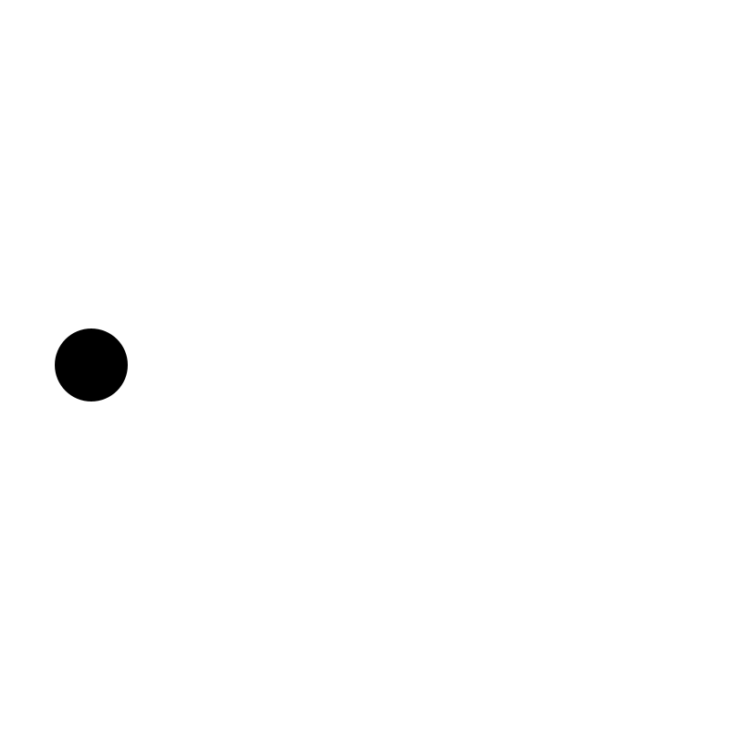
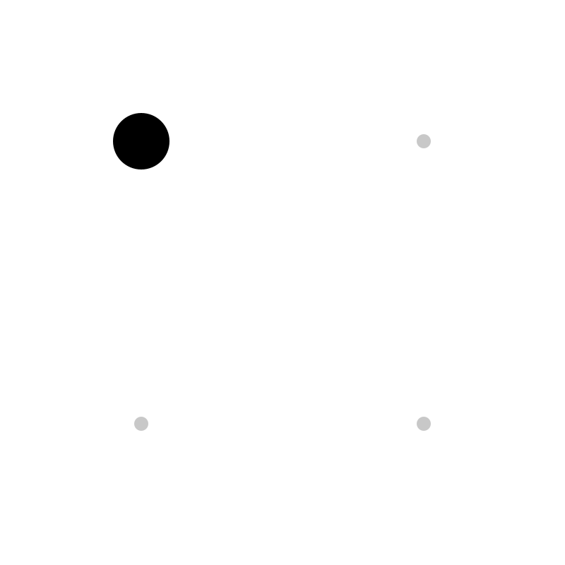
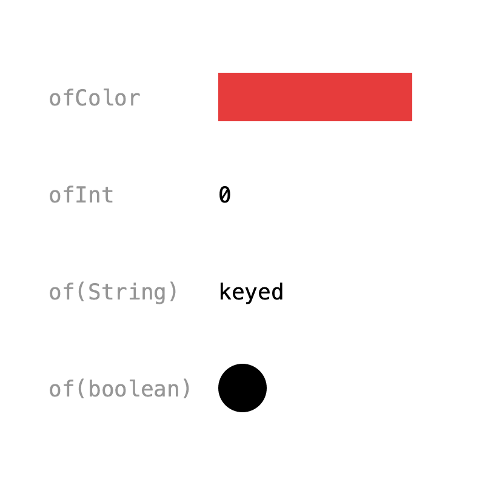
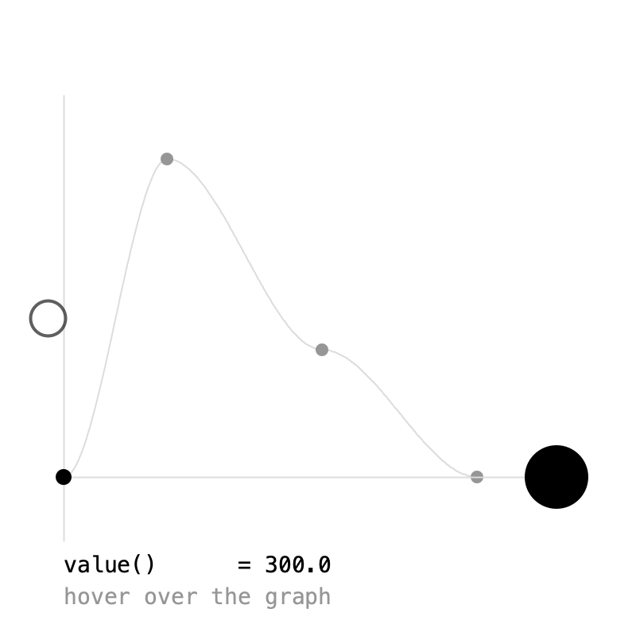

# 1. Getting Started

In this chapter you animate your first value, move things around with vectors, meet the other value types, and learn that an animation can be read at any point in time.

## Your first key

{ .sketch }

Every Keyed sketch starts by connecting the library to the sketch in `setup()`:

```java
Keyed.init(this).setDuration(2);
```

`init()` hooks Keyed into Processing, so animations follow real time without you having to advance them. It returns the **default timeline**, which we tell to loop every 2 seconds.

Next, create an animated value. `Keyed.of(0f)` makes an animated `float` (`0f` is its default, used while there are no keys). Then add **keys**: a time in seconds and the value at that time.

```java
Keyed<Float> x;

x = Keyed.of(0f)
    .key(0, 50f)
    .key(1, 350f)
    .key(2, 50f);
```

At 0 seconds `x` is 50, at 1 second it's 350, and at 2 seconds it's back at 50. In between, Keyed blends the values. In `draw()`, `value()` gives you the value at the current time:

```java
circle(x.value(), height / 2, 40);
```

That's all there is to it. The rest of this tutorial adds to this pattern.

??? example "Full sketch: FirstKey"
    ```java
    --8<-- "Basics/FirstKey/FirstKey.pde"
    ```

## Vectors

{ .sketch }

`Keyed.of(new PVector())` animates a `PVector`, blending x, y and z together. Here the ball visits one corner per second. The last key returns to the first corner, so the loop closes without a jump:

```java
pos = Keyed.of(new PVector());
for (int i = 0; i <= corners.length; i++) {
    pos.key(i, corners[i % corners.length]);
}
```

Keys store a **copy** of the vector you pass, so changing `corners` later won't move them.

??? example "Full sketch: Vectors"
    ```java
    --8<-- "Basics/Vectors/Vectors.pde"
    ```

## Value types

{ .sketch }

Keyed knows how to blend more than numbers:

| Factory | Type | How it blends |
|---|---|---|
| `Keyed.of(float)` | `Float` | linearly |
| `Keyed.ofInt(int)` | `Integer` | linearly, rounded to the nearest int |
| `Keyed.ofColor(color)` | `Integer` | red, green, blue and alpha |
| `Keyed.of(PVector)` | `PVector` | x, y and z |
| `Keyed.of(String)` | `String` | morphs one character edit at a time |
| `Keyed.of(boolean)` | `Boolean` | switches when the next key is reached |

Colors are `int`s in Processing, so they need their own factory, `ofColor()`; otherwise they'd be blended as plain numbers.

```java
col = Keyed.ofColor(color(0))
    .key(0, color(230, 60, 60))
    .key(2, color(60, 120, 230))
    .key(4, color(230, 60, 60));

word = Keyed.of("")
    .key(0, "keyed")
    .key(2, "animation")
    .key(4, "keyed");
```

Want to blend something else? See [Types](types.md).

??? example "Full sketch: ValueTypes"
    ```java
    --8<-- "Basics/ValueTypes/ValueTypes.pde"
    ```

## Any time

{ .sketch }

`value()` is the value **now**. `value(t)` is the value at **any** time `t`, past or future. Here it's used to draw the whole animation as a graph, one point per pixel:

```java
beginShape();
for (int x = (int) gx0; x <= gx1; x++) {
    float t = map(x, gx0, gx1, 0, duration);
    vertex(x, ballY.value(t));
}
endShape();
```

`keys()` lists the keys, and each key's `t()` is its time, which is handy for drawing them:

```java
for (Key k : ballY.keys()) {
    circle(tx(k.t()), ballY.value(k.t()), 8);
}
```

The current time of the default timeline is `Keyed.defaultTimeline().t()`. Hover over the graph in the sketch to read the value at any other time.

??? example "Full sketch: AnyTime"
    ```java
    --8<-- "Basics/AnyTime/AnyTime.pde"
    ```

Next: [Easing](easing.md).
