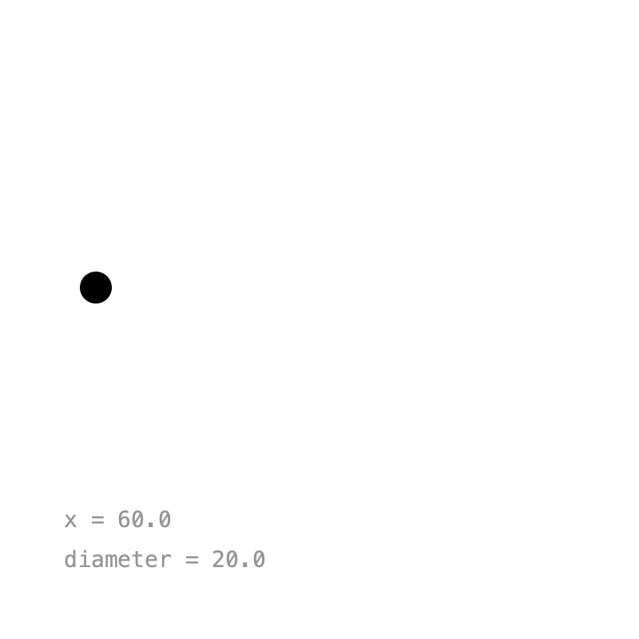
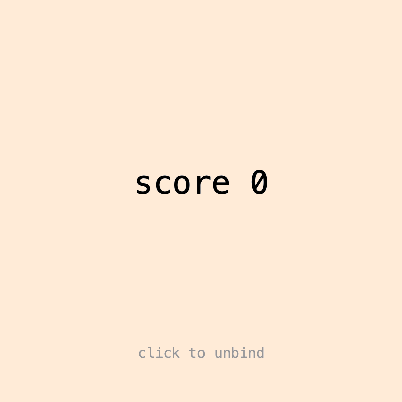
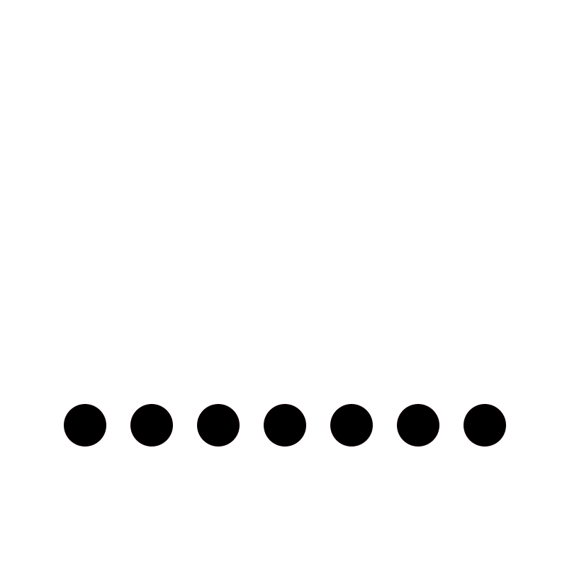

# 5. Binding

Calling `value()` everywhere gets tedious, especially with objects that draw themselves. **Binding** lets Keyed write the animated value into a field or setter before every `draw()`, so your code just uses plain variables.

## Field binding

{ .sketch }

`Keyed.bind(object, "field")` animates a `float` field by name. The field's current value becomes the default:

```java
float x = 60;
float diameter = 20;

void setup() {
    Keyed.init(this).setDuration(3);

    Keyed.bind(this, "x")
        .key(Key.at(0).setEasing(1 / 3f), 60f)
        .key(Key.at(1.5f).setEasing(1 / 3f), 340f)
        .key(Key.at(3).setEasing(1 / 3f), 60f);

    Keyed.bind(this, "diameter")
        .key(0, 20f)
        .key(1.5f, 80f)
        .key(3, 20f);
}

void draw() {
    background(255);
    circle(x, 180, diameter);
}
```

No `value()` calls: `x` and `diameter` are plain floats, already up to date.

??? example "Full sketch: FieldBinding"
    ```java
    --8<-- "Binding/FieldBinding/FieldBinding.pde"
    ```

## Setter binding

{ .sketch }

For any other type, bind a **setter**: a function that receives the animated value. Pass a `Lerp` (how to blend, see [Types](types.md)), a default value and the setter:

```java
Keyed.bind(new ColorLerp(), color(255), c -> bg = c)
    .key(0, color(255, 235, 215))
    .key(2, color(215, 230, 255))
    .key(4, color(255, 235, 215));
```

Or call `bind()` on an existing `Keyed`. The setter can convert the value, here from an `int` to a line of text:

```java
score = Keyed.ofInt(0)
    .key(0, 0)
    .key(4, 100)
    .bind(this::showScore);

void showScore(int v) {
    label = "score " + v;
}
```

- `unbind()` stops the updates, so the target keeps its last value. In the GIF the score freezes for a moment.
- `apply()` writes the value right away, without waiting for `draw()`, e.g. to use it in `setup()`.

??? example "Full sketch: SetterBinding"
    ```java
    --8<-- "Binding/SetterBinding/SetterBinding.pde"
    ```

## Binding objects

{ .sketch }

Binding shines with objects. Each `Ball` gets its `y` field bound by name, and its color through a setter method. Delaying the keys of each ball a little creates a wave:

```java
for (int i = 0; i < 7; i++) {
    Ball b = new Ball(this, 60 + i * 47, 300);
    balls.add(b);
    float delay = i * 0.1f;

    Keyed.bind(b, "y")
        .key(Key.at(delay).setEasing(1 / 3f), 300f)
        .key(Key.at(delay + 0.5f).setEasing(1 / 3f), 120f)
        .key(Key.at(delay + 1).setEasing(1 / 3f), 300f);

    Keyed.bind(new ColorLerp(), color(0), b::setColor)
        .key(delay, color(0))
        .key(delay + 0.5f, color(230, 60, 60))
        .key(delay + 1, color(0));
}
```

The balls are always up to date and simply draw themselves.

??? example "Full sketch: ObjectBinding"
    === "ObjectBinding.pde"
        ```java
        --8<-- "Binding/ObjectBinding/ObjectBinding.pde"
        ```
    === "Ball.pde"
        ```java
        --8<-- "Binding/ObjectBinding/Ball.pde"
        ```

Next: [Paths](paths.md).
