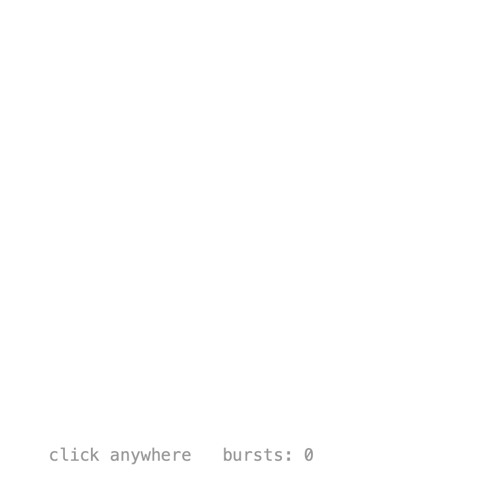

# 9. Composition

So far all animations were set up once in `setup()`. But what if you need the same animation many times, starting at different moments, like a burst on every click? A **`Composition`** is a reusable, self-contained animation on its own timeline. Like any class, it can take parameters, so every instance can look a little different.

## Click burst

{ .sketch }

Extend `Composition`, pass its duration to `super()`, and create its values with `add()`. Key times are **local**: 0 is when the composition was created.

The constructor parameters customize each burst: `size` scales the keyed values, `col` colors the dots, and `duration` sets how long it plays. The key times are fractions of the duration, so the whole animation stretches with it:

```java
class Burst extends Composition {
    PApplet g;
    float x, y;
    int col;
    Keyed<Float> ring, fade;

    Burst(PApplet g, float x, float y, float size, int col, float duration) {
        // A timeline of its own that plays once.
        super(duration);
        this.g = g;
        this.x = x;
        this.y = y;
        this.col = col;
        float d = duration;

        ring = add(Keyed.of(0f)
            .key(Key.at(0).setEasing(Easing.CUBIC_OUT), 0f)
            .key(d, 90f * size));

        fade = add(Keyed.of(0f)
            .key(0.4f * d, 255f)
            .key(d, 0f));
    }

    void draw() {
        g.noFill();
        g.stroke(0, fade.value());
        g.circle(x, y, ring.value() * 2);
        ...
    }
}
```

Each new `Burst` starts playing right away, here with a random size and color. Bigger bursts get a longer duration:

```java
void mousePressed() {
    spawn(mouseX, mouseY);
}

void spawn(float x, float y) {
    float size = random(0.4f, 1.6f);
    int col = colors[(int) random(colors.length)];
    float duration = 0.4f + 0.5f * size;
    bursts.add(new Burst(this, x, y, size, col, duration));
}
```

Once a burst `isFinished()`, `dispose()` stops its timeline so it can be garbage collected:

```java
void draw() {
    background(255);
    for (int i = bursts.size() - 1; i >= 0; i--) {
        Burst b = bursts.get(i);
        b.draw();
        if (b.isFinished()) {
            b.dispose();
            bursts.remove(i);
        }
    }
}
```

Call `play()` to restart a composition from the beginning, and `timeline()` to control it like any other [timeline](timeline.md).

The sketch also spawns a burst every 0.4 seconds with `onLoop()`, so there is something to see without clicking.

??? example "Full sketch: ClickBurst"
    === "ClickBurst.pde"
        ```java
        --8<-- "09_Composition/ClickBurst/ClickBurst.pde"
        ```
    === "Burst.pde"
        ```java
        --8<-- "09_Composition/ClickBurst/Burst.pde"
        ```

Next: [Export](export.md).
