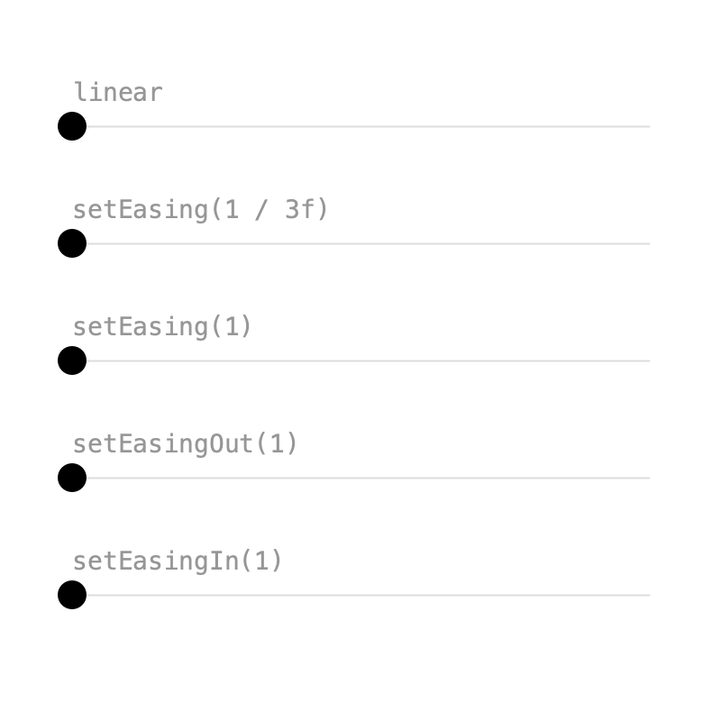
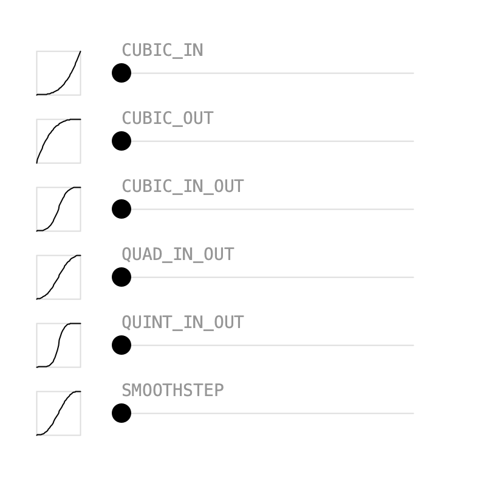
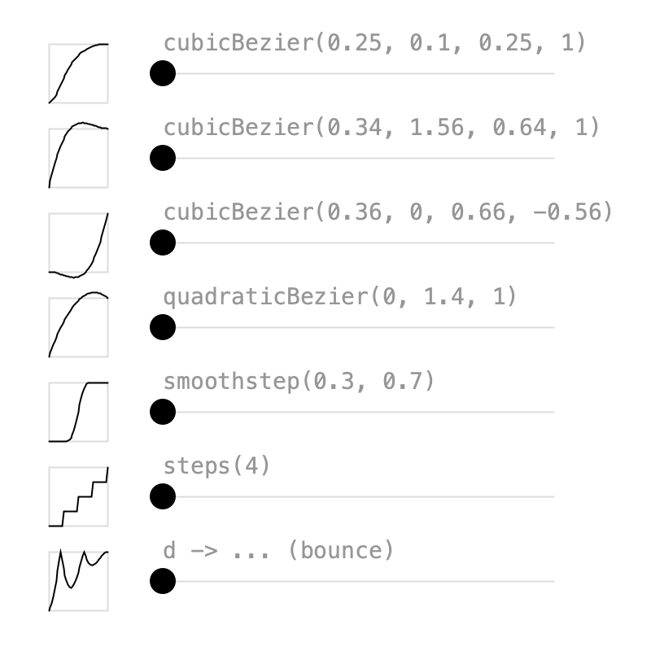
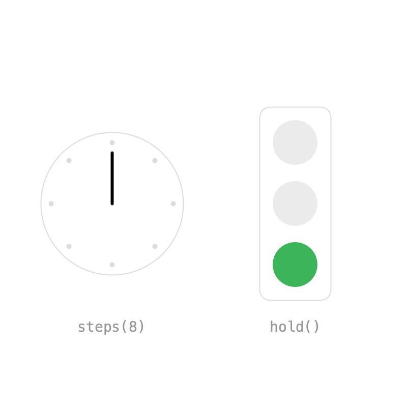

# 2. Easing

Without easing, values move at constant speed and stop abruptly at each key. Easing changes the speed between keys, so motion feels natural. In Keyed, easing is set on a key with `Key.at(t)` instead of a plain time.

## Influence

{ .sketch }

Inspired by After Effects, easing is an **influence** between 0 and 1 that slows the motion near a key.

```java
easy = Keyed.of(0f)
    .key(Key.at(0).setEasing(1 / 3f), x0)
    .key(Key.at(1.5f).setEasing(1 / 3f), x1)
    .key(Key.at(3).setEasing(1 / 3f), x0);
```

- `setEasing(1 / 3f)` is similar to After Effects' *Easy Ease*.
- Higher influence, like `setEasing(1)`, is slower near the keys and faster in between.
- `setEasingOut()` only eases **leaving** a key: soft start, hard stop.
- `setEasingIn()` only eases **arriving** at a key: hard start, soft stop.

??? example "Full sketch: Influence"
    ```java
    --8<-- "02_Easing/Influence/Influence.pde"
    ```

## Presets

{ .sketch }

`setEasing()` also accepts an `Easing` curve. Keyed has the usual presets:

- `QUAD`, `CUBIC`, `QUART` and `QUINT`, each with `_IN`, `_OUT` and `_IN_OUT`, e.g. `Easing.CUBIC_IN_OUT`
- `Easing.SMOOTHSTEP` and `Easing.HOLD`

An `Easing` shapes the whole segment from its key to the next one, so the last key doesn't need one:

```java
Keyed.of(0f)
    .key(Key.at(0).setEasing(Easing.CUBIC_IN_OUT), x0)
    .key(Key.at(1.5f).setEasing(Easing.CUBIC_IN_OUT), x1)
    .key(3, x0);
```

An `Easing` is just a function from linear progress to eased progress, both from 0 to 1. Call `apply(d)` to use it yourself, e.g. to draw the little graphs in the sketch. The presets also exist as plain functions, like `Easing.quadIn(x)`.

??? example "Full sketch: Presets"
    ```java
    --8<-- "02_Easing/Presets/Presets.pde"
    ```

## Custom curves

{ .sketch }

When the presets aren't enough, build your own:

```java
// Same as CSS cubic-bezier(); this one is CSS "ease".
Easing.cubicBezier(0.25f, 0.1f, 0.25f, 1)
// y values above 1 overshoot the target...
Easing.cubicBezier(0.34f, 1.56f, 0.64f, 1)
// ...and below 0 pull back before moving.
Easing.cubicBezier(0.36f, 0, 0.66f, -0.56f)
// Starts at 0, ends at 1, pulled towards the middle value.
Easing.quadraticBezier(0, 1.4f, 1)
// Waits until 0.3, moves smoothly, arrives at 0.7.
Easing.smoothstep(0.3f, 0.7f)
// Jumps in 4 equal steps, like CSS steps().
Easing.steps(4)
```

`Easing` is a functional interface, so any function of `d` works too. This one bounces:

```java
Easing bounce = d -> 1 - abs(cos(d * 2.5f * PI)) * (1 - d);
```

There are also `Easing.powerIn(p)`, `powerOut(p)` and `powerInOut(p)` for any power.

??? example "Full sketch: CustomBezier"
    ```java
    --8<-- "02_Easing/CustomBezier/CustomBezier.pde"
    ```

## Hold

{ .sketch }

Sometimes values should jump instead of blend. There are two ways:

- **Even jumps:** `Easing.steps(n)` on a single segment. The clock hand makes one full turn in 8 equal steps.
- **Uneven timing:** `hold()` keeps a key's value until the next key. The traffic light is green for 2 seconds, yellow for 0.5 and red for 1.5.

```java
hand = Keyed.of(0f)
    .key(Key.at(0).setEasing(Easing.steps(8)), 0f)
    .key(4, TWO_PI);

lamp = Keyed.ofInt(0)
    .key(Key.at(0).hold(), 2)
    .key(Key.at(2).hold(), 1)
    .key(2.5f, 0);
```

Without `hold()`, the lamp index would be blended and rounded, switching halfway between keys.

??? example "Full sketch: Hold"
    ```java
    --8<-- "02_Easing/Hold/Hold.pde"
    ```

Next: [Timelines](timeline.md).
