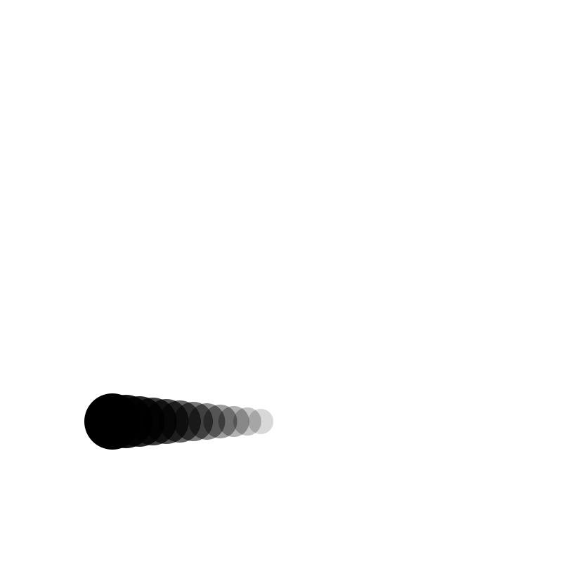
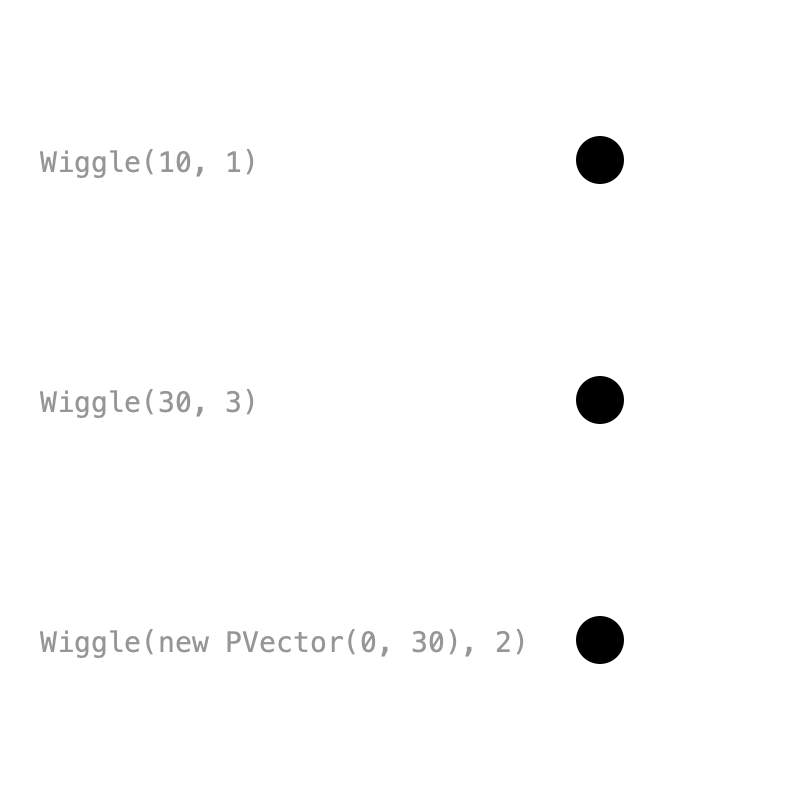
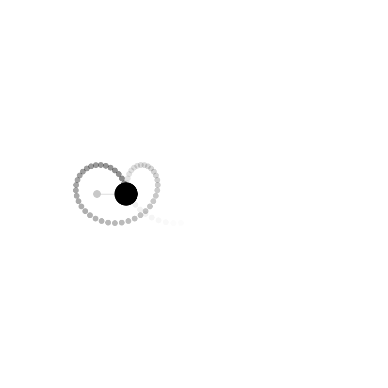
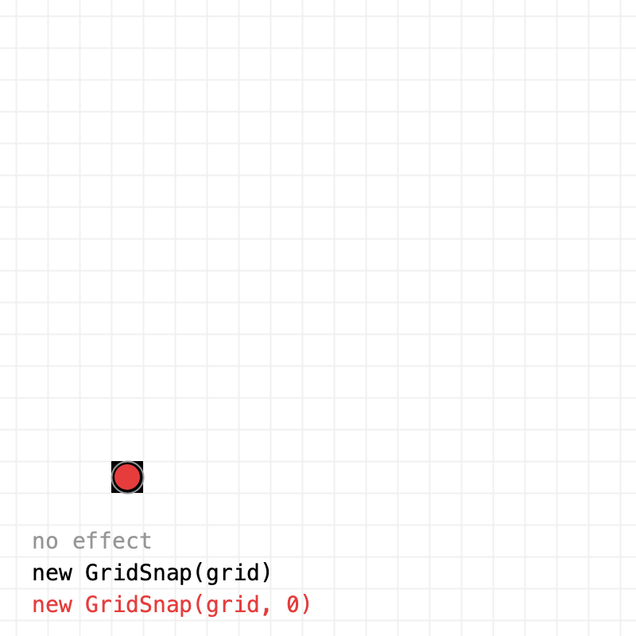
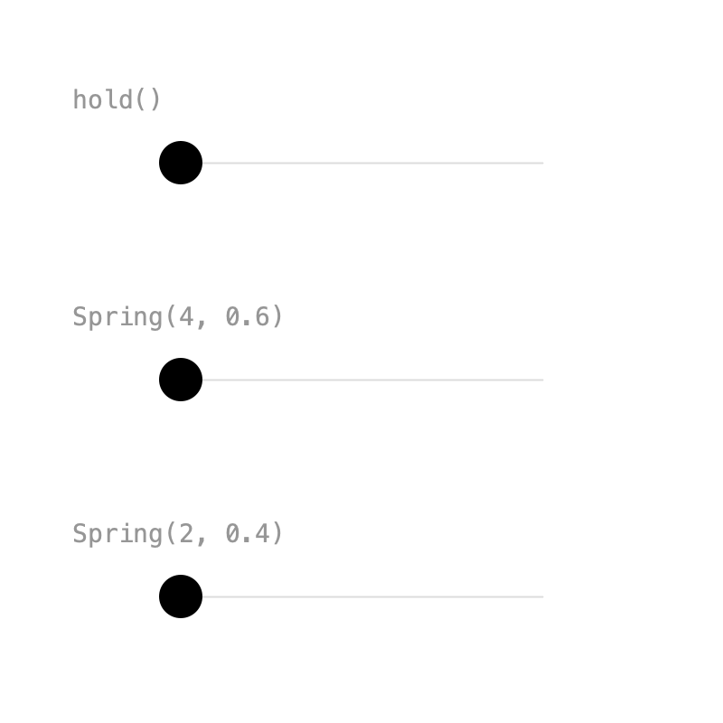
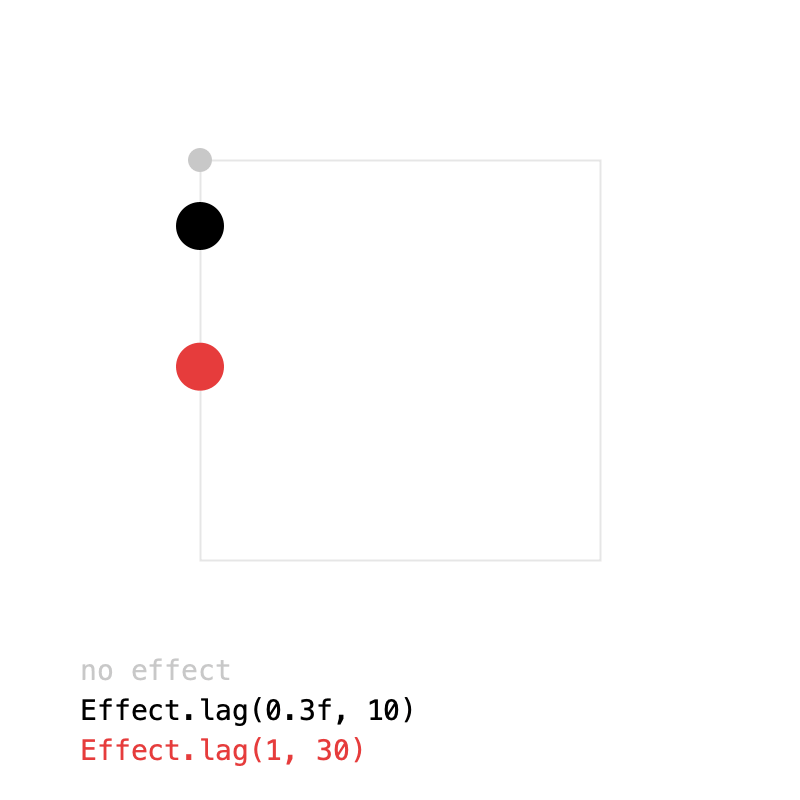
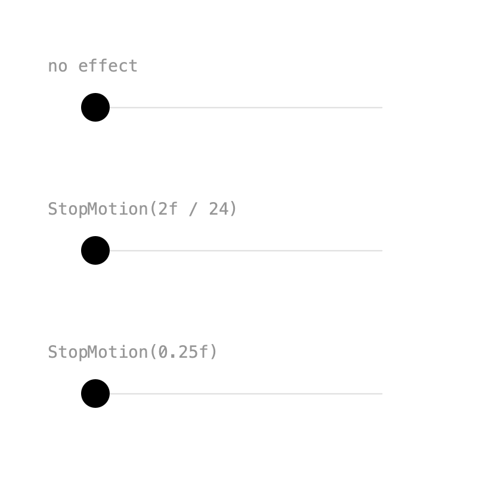
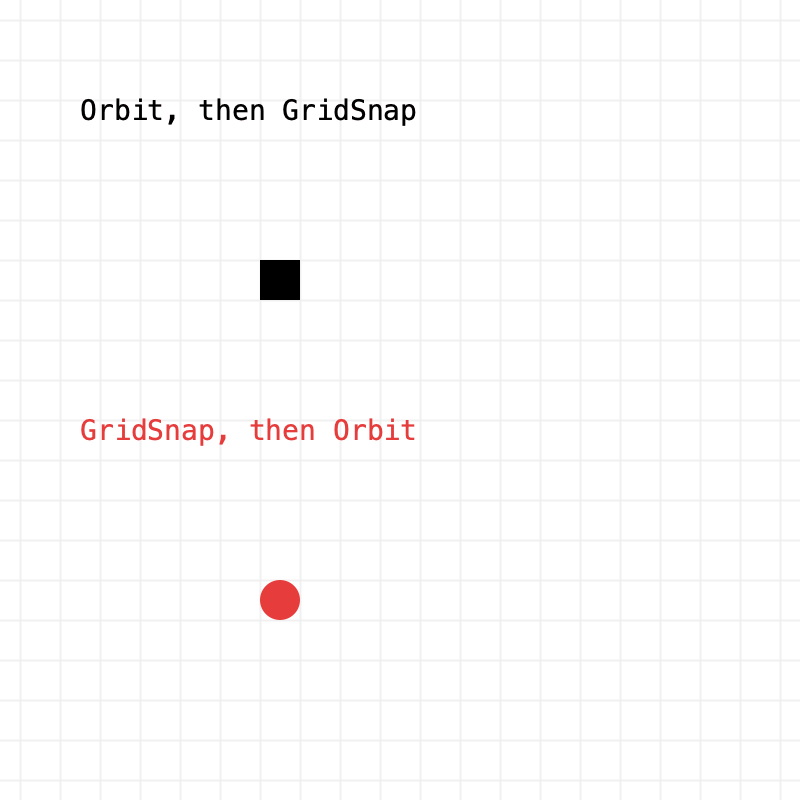
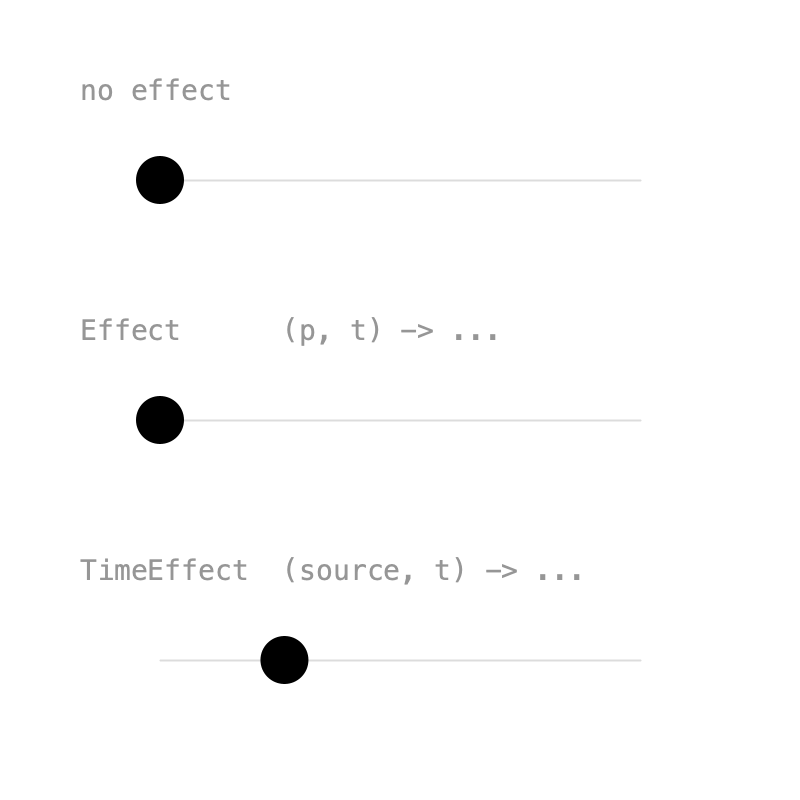

# 7. Effects

Effects change a value **on top of** its keys: shake it, circle it, snap it to a grid, or let it spring after the keyed motion. Add them with `addEffect()`. Most effects live in their own package:

```java
import ch.domizai.keyed.effect.*;
```

## Echo

{ .sketch }

Before the effects proper, a related tool: `echo(samples, delay)` returns the value now, `delay` seconds ago, `2 * delay` seconds ago, and so on. That's a ready-made motion trail:

```java
List<PVector> trail = pos.echo(12, 0.04f);

for (int i = trail.size() - 1; i >= 0; i--) {
    PVector p = trail.get(i);
    fill(0, map(i, 0, trail.size(), 255, 20));
    circle(p.x, p.y, 40 - i * 2);
}
```

Drawing oldest first puts the current position on top. A negative delay samples the future instead.

??? example "Full sketch: Echo"
    ```java
    --8<-- "Effects/Echo/Echo.pde"
    ```

## Wiggle

{ .sketch }

`Wiggle(amplitude, frequency)` adds a smooth random offset of up to ±`amplitude`, changing direction about `frequency` times per second, inspired by After Effects' `wiggle()`. Effects work even without keys: the value is just its default, and the effect still moves it.

```java
gentle = Keyed.of(new PVector(300, 80))
    .addEffect(new Wiggle(10, 1));

// An amplitude per axis: this one only moves up and down.
vertical = Keyed.of(new PVector(300, 320))
    .addEffect(new Wiggle(new PVector(0, 30), 2));
```

Every `Wiggle` moves differently. Pass a seed as a third argument, and wiggles with the same seed and settings move the same way. On a looping timeline, `Wiggle` loops seamlessly when duration × frequency is a whole number.

??? example "Full sketch: WiggleEffect"
    ```java
    --8<-- "Effects/WiggleEffect/WiggleEffect.pde"
    ```

## Orbit

{ .sketch }

`Orbit(radius, frequency)` circles around the value, `frequency` times per second. `Orbit(radius, frequency, axis)` circles around any 3D axis instead.

```java
ball = motion().addEffect(new Orbit(30, 2));
```

2 circles per second in a 4 second loop is a whole number of circles, so the loop is seamless. The trail comes from `echo()`.

??? example "Full sketch: OrbitEffect"
    ```java
    --8<-- "Effects/OrbitEffect/OrbitEffect.pde"
    ```

## Grid snap

{ .sketch }

`GridSnap(size)` rounds x and y to multiples of `size`, so the motion jumps from cell to cell. `GridSnap(sizeX, sizeY)` uses a size per axis, and 0 leaves that axis alone:

```java
snapped = motion().addEffect(new GridSnap(grid));
snappedX = motion().addEffect(new GridSnap(grid, 0));
```

??? example "Full sketch: GridSnapEffect"
    ```java
    --8<-- "Effects/GridSnapEffect/GridSnapEffect.pde"
    ```

## Spring

{ .sketch }

`Spring(lerp, frequency, damping)` follows the value like a spring: it lags behind, overshoots and settles. `frequency` is in wobbles per second; `damping` goes from 0 (wobbles forever) to 1 (no wobble).

```java
stiff = jump().addEffect(new Spring<>(new FloatLerp(), 4, 0.6f));
wobbly = jump().addEffect(new Spring<>(new FloatLerp(), 2, 0.4f));
```

Spring needs a `Lerp` to work with any type. For `PVector`s there is a shortcut: `Effect.spring(2, 0.4f)`.

??? example "Full sketch: SpringEffect"
    ```java
    --8<-- "Effects/SpringEffect/SpringEffect.pde"
    ```

## Lag

{ .sketch }

`Lag` averages the value over the last `duration` seconds: it trails behind and rounds off sharp corners, without overshooting. More samples is smoother, but each one costs an evaluation.

```java
shortLag = square().addEffect(Effect.lag(0.3f, 10));
longLag = square().addEffect(Effect.lag(1, 30));
```

`Effect.lag()` is the shortcut for `PVector`s; other types use `new Lag<>(lerp, duration, samples)`.

??? example "Full sketch: LagEffect"
    ```java
    --8<-- "Effects/LagEffect/LagEffect.pde"
    ```

## Stop motion

{ .sketch }

`StopMotion(step)` holds each pose for `step` seconds, whatever the keys. `2f / 24` is "on twos" at 24 fps, common in hand-drawn animation.

```java
onTwos = sweep().addEffect(new StopMotion<>(2f / 24));
choppy = sweep().addEffect(new StopMotion<>(0.25f));
```

Unlike `Key.hold()`, which holds single keys, `StopMotion` samples the whole animation at a fixed rate.

??? example "Full sketch: StopMotionEffect"
    ```java
    --8<-- "Effects/StopMotionEffect/StopMotionEffect.pde"
    ```

## Stacking effects

{ .sketch }

`addEffect()` can be called several times. Effects apply in the order they are added, each one to the result of the one before, so the order matters:

```java
// Orbit, then GridSnap: the whole circle snaps to the grid.
snapLast = motion(130)
    .addEffect(new Orbit(40, 1))
    .addEffect(new GridSnap(grid));

// GridSnap, then Orbit: only the center snaps, the circle stays smooth.
snapFirst = motion(290)
    .addEffect(new GridSnap(grid))
    .addEffect(new Orbit(40, 1));
```

??? example "Full sketch: Stacking"
    ```java
    --8<-- "Effects/Stacking/Stacking.pde"
    ```

## Custom effects

{ .sketch }

Writing your own effect takes one line. There are two kinds:

- An **`Effect`** gets the value and the time, and returns a new value.
- A **`TimeEffect`** gets the animation itself as a `Tween`, so it can read the value at any other time. Spring and Lag are time effects.

```java
// Bobs up and down twice per second.
Effect<PVector> bob = (p, t) -> new PVector(p.x, p.y + 15 * sin(t * TWO_PI * 2));
bobbing = sweep(210).addEffect(bob);

// Plays the animation half a second late.
TimeEffect<PVector> late = (source, t) -> source.value(t - 0.5f);
delayed = sweep(330).addEffect(late);
```

Declaring the type tells Java which kind of effect the lambda is. Both can also be classes that implement `Effect` or `TimeEffect`.

??? example "Full sketch: CustomEffect"
    ```java
    --8<-- "Effects/CustomEffect/CustomEffect.pde"
    ```

Next: [Types](types.md).
