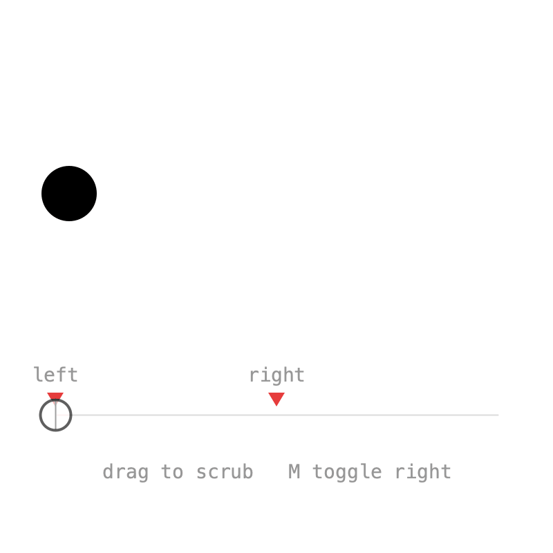
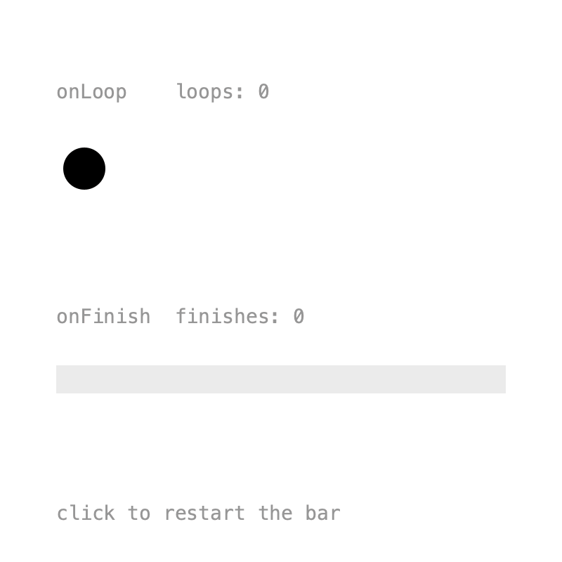

# 4. Events

Animations often need to trigger something: a sound, a particle burst, the next scene. Timelines can call you back at specific times, when they loop, and when they finish.

## Markers

{ .sketch }

A **marker** calls back whenever playback crosses its time. It can be placed at a time or on a pin, and optionally named:

```java
hit = Pin.at(1.5f);

x = Keyed.ofFloat()
    .key(0, 50f)
    .key(hit, 350f)
    .key(3, 50f);

tm.addMarker("left", 0, this::fired);
tm.addMarker("right", hit, this::fired);
```

The callback receives the `Marker`, with its `name()` and `t()`:

```java
void fired(Marker m) {
    last = m.name() + " at " + nf(m.t(), 1, 2);
}
```

Placing a marker on the key's pin means it fires exactly when the ball arrives, even after the pin is moved.

Markers fire during playback in either direction, also when a loop wraps around. Jumping with `to(t)` fires nothing, but `to(t, true)` fires every marker passed on the way. That's what the sketch uses while scrubbing:

```java
tm.to(t, true);
```

Markers can be looked up with `marker(name)` or `markers()`, and removed with `removeMarker()`. Press ++m++ in the sketch to toggle the right one.

??? example "Full sketch: Markers"
    ```java
    --8<-- "04_Events/Markers/Markers.pde"
    ```

## Loop and finish

{ .sketch }

`onLoop()` is called every time a looping timeline wraps around. `onFinish()` is called once when a non-looping timeline reaches its end:

```java
tm.onLoop(t -> loops++);

once = new Timeline().setDuration(2, false);
once.onFinish(t -> {
    finishes++;
    doneFlash = 255;
});
```

After restarting with `once.to(0)`, `onFinish()` fires again at the end. To stop listening, keep the lambda in a variable and pass it to `removeListener()`.

??? example "Full sketch: LoopFinish"
    ```java
    --8<-- "04_Events/LoopFinish/LoopFinish.pde"
    ```

Next: [Binding](binding.md).
