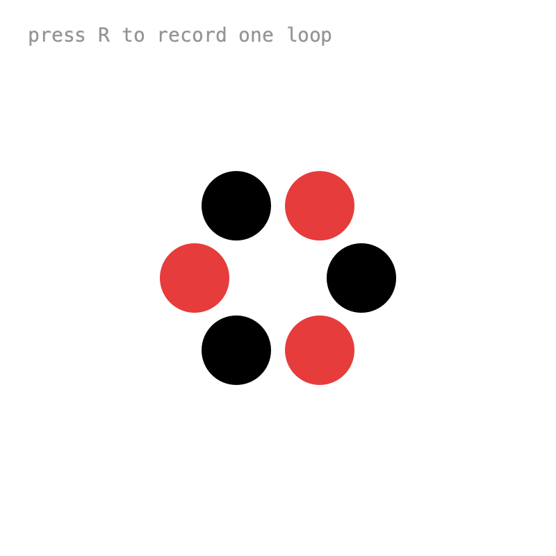

# 10. Export

To turn a sketch into a video, you save every frame with `saveFrame()`. But saving is slow, and a timeline that follows the real clock skips ahead to stay on time. The frames end up unevenly timed, and the video plays at the wrong speed.

## Save frames

{ .sketch }

`setFixedStep()` makes every `draw()` advance the timeline by exactly the same amount, however long it takes:

```java
int fps = 30;

void setup() {
    frameRate(fps);
    tm = Keyed.init(this).setDuration(3);
    tm.setFixedStep(1f / fps);
}
```

To do the same for all timelines, set it globally before creating them:

```java
Keyed.setFrameRate(fps);
Keyed.sync(false);
Keyed.init(this);
```

To record exactly one loop, start and stop recording in `onLoop()`:

```java
tm.onLoop(t -> {
    if (recording) {
        recording = false;
    }
    if (requested) {
        requested = false;
        recording = true;
        frame = 0;
    }
});
```

and save in `draw()`:

```java
if (recording) {
    saveFrame("frames/" + nf(frame, 4) + ".png");
    frame++;
}
```

Anything drawn after `saveFrame()` doesn't end up in the frames, which is handy for status text. Turn the frames into a video with *Tools > Movie Maker*.

!!! info
    The GIFs on this site were made this way: every example ran with `Keyed.sync(false)`, saving one frame per `draw()`.

??? example "Full sketch: SaveFrames"
    ```java
    --8<-- "10_Export/SaveFrames/SaveFrames.pde"
    ```

That's the end of the tutorial. For a compact summary of everything, see the [API Overview](../api.md).
