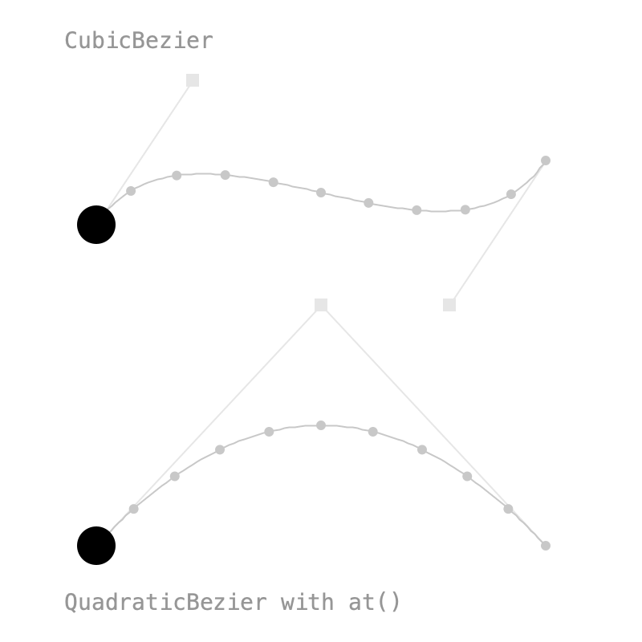
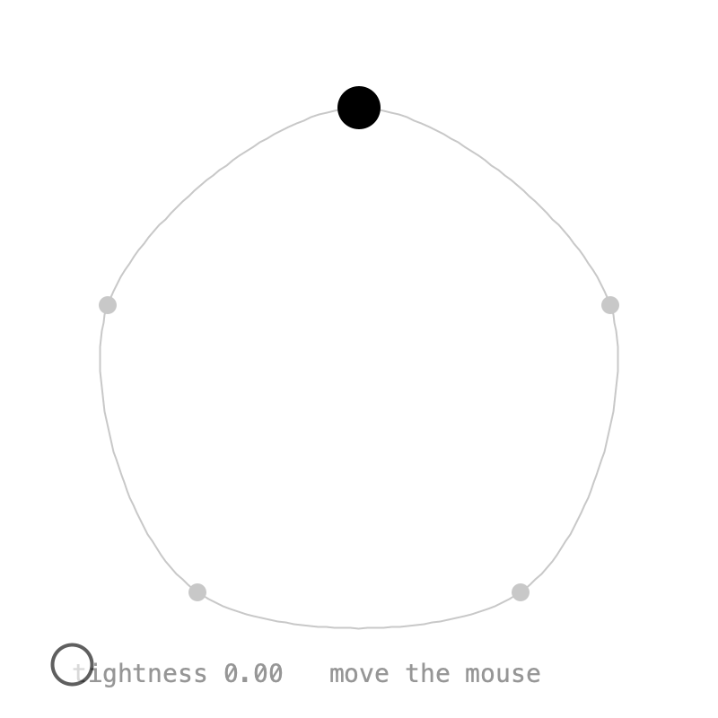
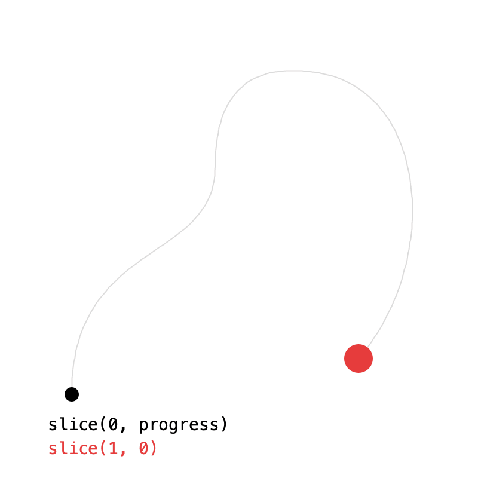
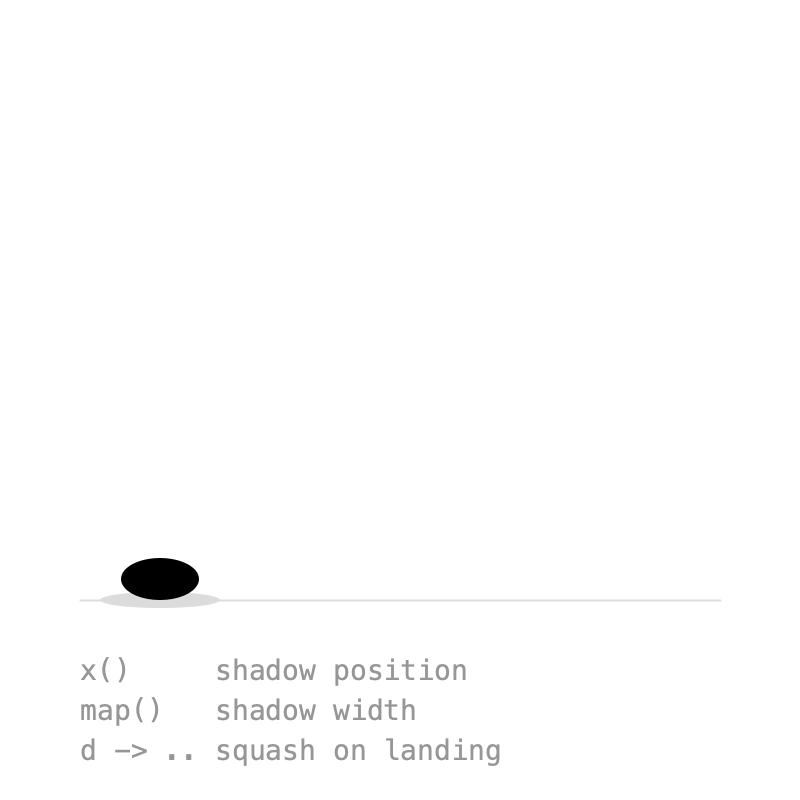
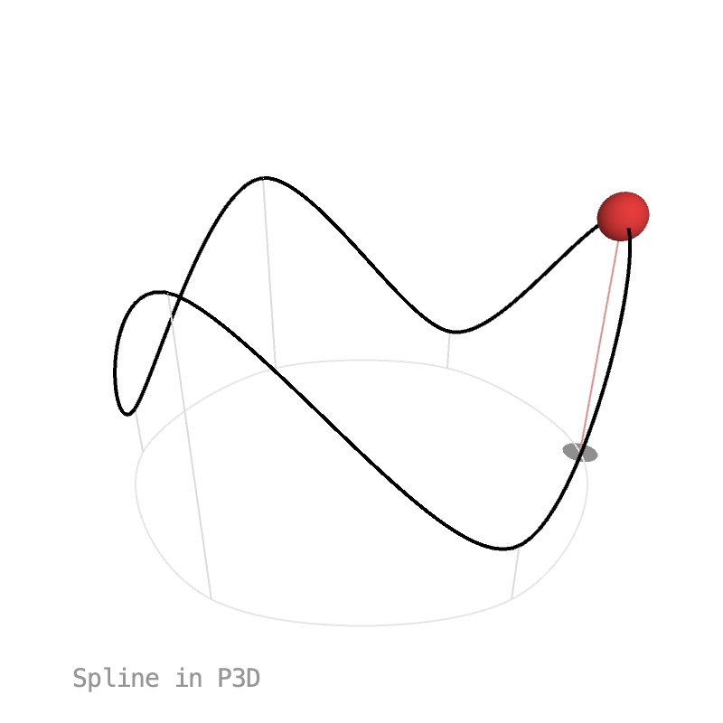

# 6. Paths

Blending two `PVector`s moves in a straight line. To move along a curve, a key can follow a **path** instead of holding a fixed value. The path classes live in their own package:

```java
import ch.domizai.keyed.tween.*;
```

## Bézier curves

{ .sketch }

`CubicBezier` takes the same four points as Processing's `bezier()`, `QuadraticBezier` takes three:

```java
cubic = new CubicBezier(c[0], c[1], c[2], c[3]);
quad = new QuadraticBezier(q[0], q[1], q[2]);
```

Two keys on the same path travel along all of it, start to end:

```java
a = Keyed.ofPVector()
    .key(0, cubic)
    .key(3, cubic);
```

`at()` pins a key to one position on the path: 0 is the start, 1 the end. From `at(0)` to `at(1)` and back to `at(0)` goes there and back again. Easing works as usual, shaping the progress along the path:

```java
b = Keyed.ofPVector()
    .key(Key.at(0).setEasing(1 / 3f), quad.at(0))
    .key(Key.at(1.5f).setEasing(1 / 3f), quad.at(1))
    .key(Key.at(3).setEasing(1 / 3f), quad.at(0));
```

A path is a `Tween<PVector>`: `value(d)` is the point at `d`, from 0 to 1. Paths are traveled at **constant speed**, so even steps in `d` are evenly spaced, as the dots in the sketch show.

??? example "Full sketch: Bezier"
    ```java
    --8<-- "06_Paths/Bezier/Bezier.pde"
    ```

## Splines

{ .sketch }

`Spline` works like `curveVertex()`: the curve passes through every point except the first and last, which only shape its ends. Wrapping the points around closes the loop:

```java
spline = new Spline(pts[4], pts[0], pts[1], pts[2], pts[3], pts[4], pts[0], pts[1]);

pos = Keyed.ofPVector()
    .key(0, spline)
    .key(5, spline);
```

`setTightness()` is the same as `curveTightness()`: 0 is round, 1 gives straight lines. In the sketch, the mouse controls it.

??? example "Full sketch: SplinePath"
    ```java
    --8<-- "06_Paths/SplinePath/SplinePath.pde"
    ```

## Chaining and slicing

{ .sketch }

`add()` chains paths into a `Curve`, played one after another at even speed. Each path should start where the previous one ends:

```java
curve = new CubicBezier(...)
    .add(new QuadraticBezier(...))
    .add(new CubicBezier(...));
```

`slice(t0, t1)` is the part of a path between `t0` and `t1`. Here the black line is drawn on with `curve.slice(0, progress)`. With `t1 < t0` the slice runs backwards, which is how the red ball travels the curve in reverse:

```java
reversed = curve.slice(1, 0);
back = Keyed.ofPVector()
    .key(0, reversed)
    .key(4, reversed);
```

??? example "Full sketch: CurveSlice"
    ```java
    --8<-- "06_Paths/CurveSlice/CurveSlice.pde"
    ```

## Tweens

{ .sketch }

Paths are one kind of `Tween<T>`: a value as a function of `d` from 0 to 1. Tweens can be transformed:

- `x()` and `y()` turn a path into a `Tween<Float>` of one coordinate. The shadow follows the ball along the ground with `hop.x()`.
- `map(f)` turns a tween's values into something else. The higher the ball, the narrower its shadow.

```java
Tween<Float> hopX = hop.x();
shadowX = Keyed.ofFloat()
    .key(0, hopX)
    .key(2, hopX);

Tween<Float> hopWidth = hop.map(p -> map(p.y, ground - r, 140, 60, 20));
```

And since a `Tween` is just a function, a lambda works too. This one squashes the ball as it lands:

```java
Tween<Float> landing = d -> 1 - 0.3f * pow(abs(cos(d * TWO_PI)), 12);
squash = Keyed.ofFloat()
    .key(0, landing)
    .key(2, landing);
```

??? example "Full sketch: TweenMap"
    ```java
    --8<-- "06_Paths/TweenMap/TweenMap.pde"
    ```

## Paths in 3D

{ .sketch }

Paths use x, y and z, so everything above works in `P3D` too. The track is a closed `Spline` through six points, and the shadow is the same track flattened onto the ground with `map()`:

```java
track = new Spline(pts[5], pts[0], pts[1], pts[2], pts[3], pts[4], pts[5], pts[0], pts[1]);
shadowPath = track.map(p -> new PVector(p.x, ground, p.z));
```

??? example "Full sketch: Path3D"
    ```java
    --8<-- "06_Paths/Path3D/Path3D.pde"
    ```

Next: [Effects](effects.md).
