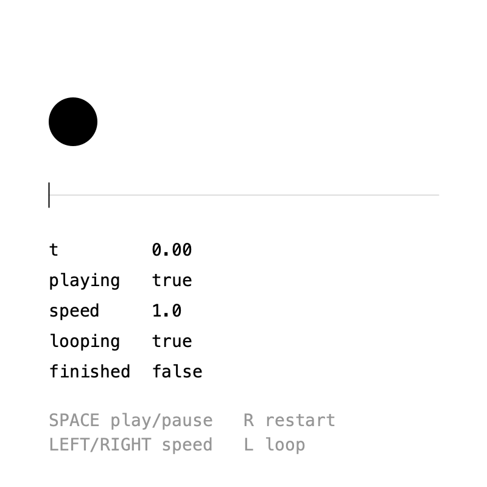
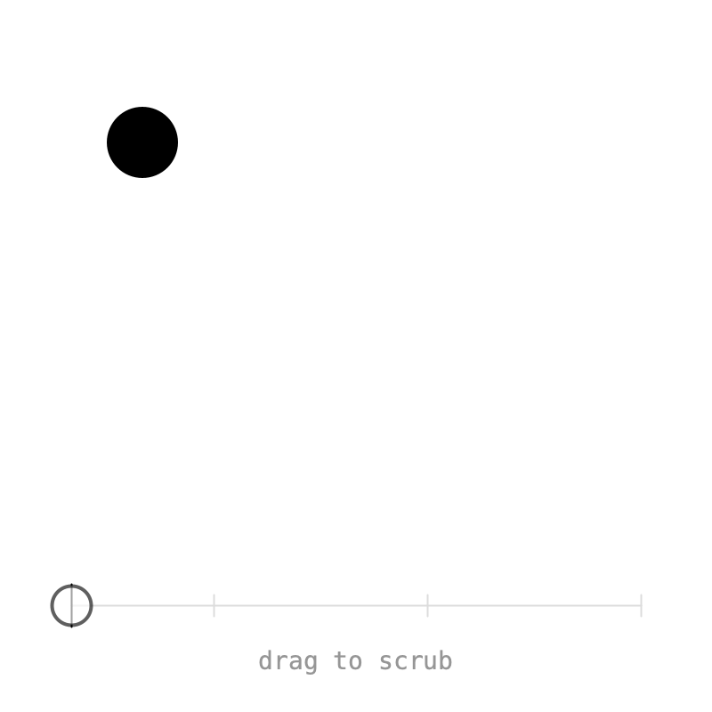
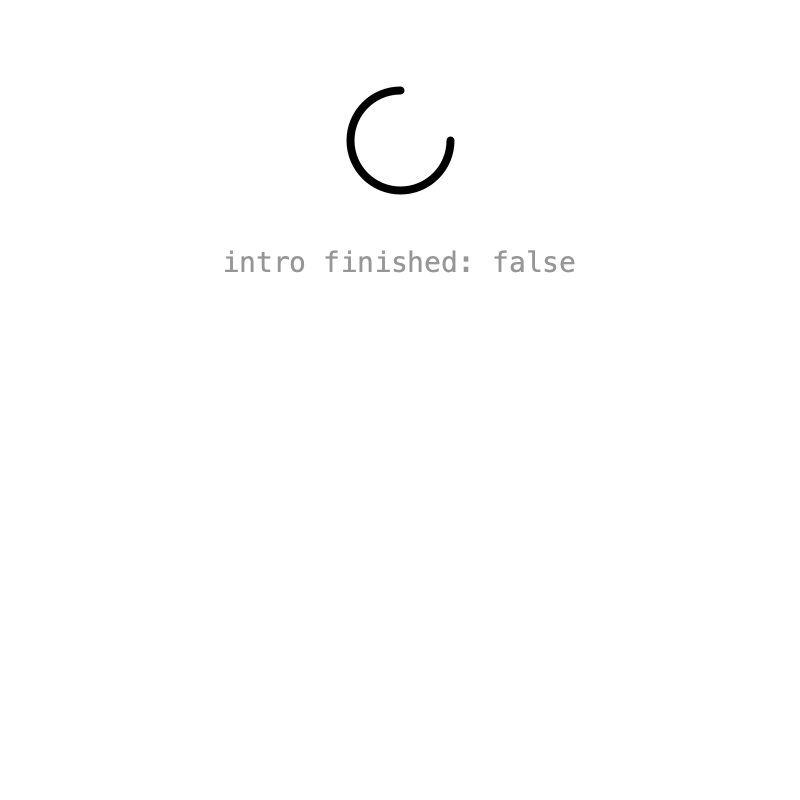
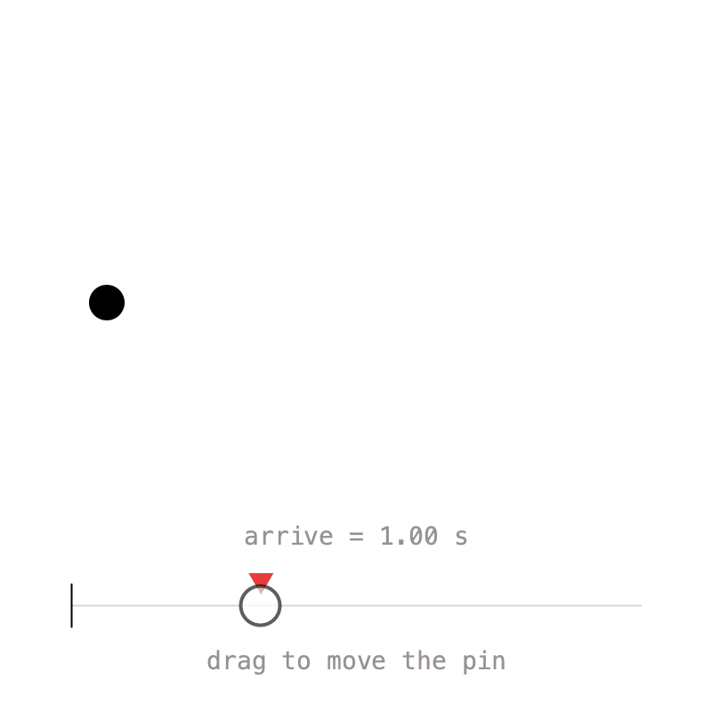
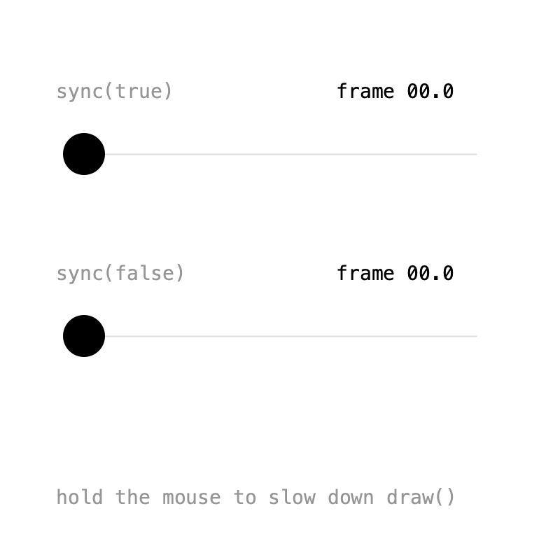

# 3. Timelines

So far every value followed the default timeline returned by `Keyed.init()`. In this chapter you create timelines of your own, control their playback, scrub through them, run several at once, retime keys with pins, and count in frames instead of seconds.

## Controls

{ .sketch }

A `Timeline` is a clock. Create one with `new Timeline()` and attach values to it with `setTimeline()`:

```java
Keyed.init(this);

tm = new Timeline().setDuration(3);

x = Keyed.of(0f)
    .setTimeline(tm)
    .key(Key.at(0).setEasing(1 / 3f), 60f)
    .key(Key.at(1.5f).setEasing(1 / 3f), 340f)
    .key(Key.at(3).setEasing(1 / 3f), 60f);
```

!!! note
    Call `Keyed.init(this)` first: only timelines created after it advance with the sketch.

The timeline can then be controlled while it runs:

| Method | What it does |
|---|---|
| `play(boolean)` | pauses or resumes; `isPlaying()` tells which |
| `to(t)` | jumps to time `t` |
| `setSpeed(s)` | `2` is twice as fast; negative speeds play backwards |
| `loop(boolean)` | without looping, the timeline stops at its duration |
| `t()` | the current time |
| `isFinished()` | whether a non-looping timeline reached its end |

In the GIF, the timeline is paused with ++space++, then played backwards at speed −0.5, and finally sped up again.

??? example "Full sketch: Controls"
    ```java
    --8<-- "Timeline/Controls/Controls.pde"
    ```

## Scrubbing

{ .sketch }

Because `to(t)` jumps to any time, a progress bar is easy to make draggable. Pause while dragging, so the timeline doesn't advance on its own:

```java
void draw() {
    if (mousePressed) {
        float t = map(constrain(mouseX, barX0, barX1), barX0, barX1, 0, tm.duration());
        tm.to(t);
    }
    ...
}

void mousePressed() {
    tm.play(false);
}

void mouseReleased() {
    tm.play(true);
}
```

??? example "Full sketch: Scrubbing"
    ```java
    --8<-- "Timeline/Scrubbing/Scrubbing.pde"
    ```

## Multiple timelines

{ .sketch }

Each timeline is an independent clock. Here the spinner loops on the default timeline, while a card slides in on a second timeline that **plays once**. Pass `false` as the second argument of `setDuration()` to turn looping off:

```java
intro = new Timeline().setDuration(1.2f, false);

cardY = Keyed.of(0f)
    .setTimeline(intro)
    .key(Key.at(0).setEasing(Easing.CUBIC_OUT), 420f)
    .key(1.2f, 180f);
```

Clicking calls `intro.to(0)`, which replays the intro without affecting the spinner.

??? example "Full sketch: Multiple"
    ```java
    --8<-- "Timeline/Multiple/Multiple.pde"
    ```

## Pins

{ .sketch }

When several values share a moment, say a ball arriving while it grows and turns red, retiming means editing every key. A `Pin` is a point in time that several keys can share. Pass the pin instead of a time:

```java
arrive = Pin.at(1);

x = Keyed.of(0f)
    .key(Key.at(0).setEasing(1 / 3f), 60f)
    .key(Key.at(arrive).setEasing(1 / 3f), 340f)
    .key(Key.at(duration).setEasing(1 / 3f), 60f);

size = Keyed.of(0f)
    .key(0, 20f)
    .key(arrive, 80f)
    .key(duration, 20f);
```

Now `arrive.to(t)` moves the key in all values at once. Drag the pin in the sketch to try it. Use `addListener()` to get notified when a pin moves.

??? example "Full sketch: Pins"
    ```java
    --8<-- "Timeline/Pins/Pins.pde"
    ```

## Frames instead of seconds

{ .sketch }

If you think in frames, set the unit before creating timelines. Keyed can't read the sketch's frame rate, so pass the same value:

```java
frameRate(30);
Keyed.setFrameRate(30);
Keyed.setUnit(Keyed.FRAME);
Keyed.init(this);
```

Key times are then frames: keys at 0, 45 and 90 are 3 seconds at 30 fps.

This sketch also shows the two ways a timeline can advance:

- `sync(true)`, the default, follows the real clock. If `draw()` is slow, it **skips ahead** to stay on time.
- `sync(false)` advances exactly one frame per `draw()`. If `draw()` is slow, it **slows down**, but never skips a frame.

In the GIF, `draw()` is slowed down for a moment: the top ball jumps ahead while the bottom one falls behind. `sync(false)` is what you want for [exports](export.md).

??? example "Full sketch: FrameUnit"
    ```java
    --8<-- "Timeline/FrameUnit/FrameUnit.pde"
    ```

Next: [Events](events.md).
