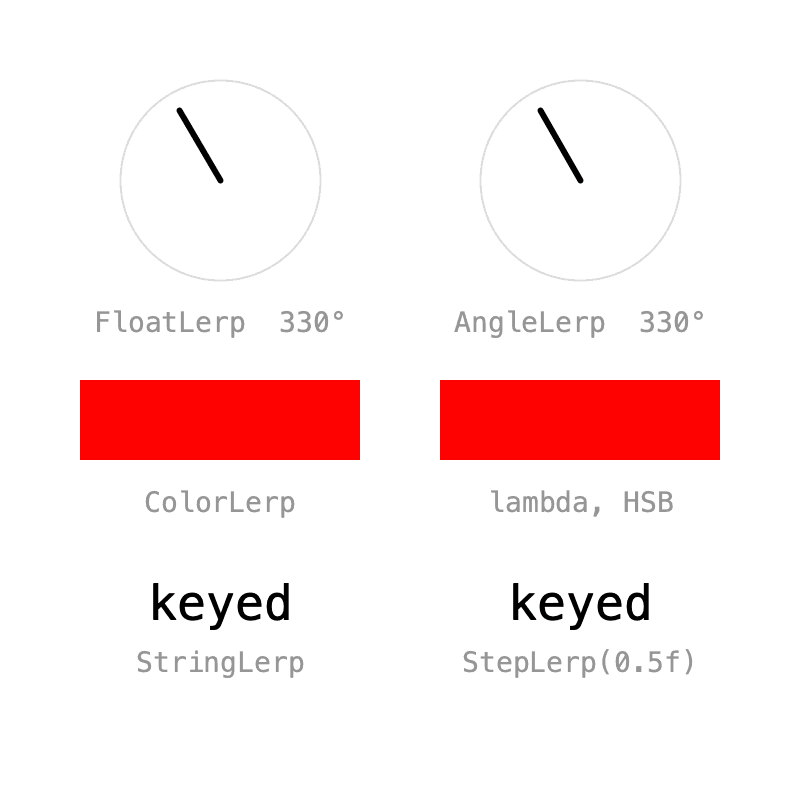
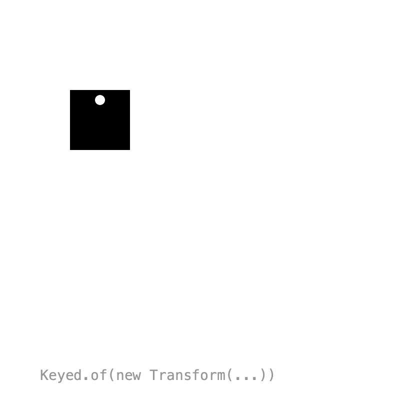
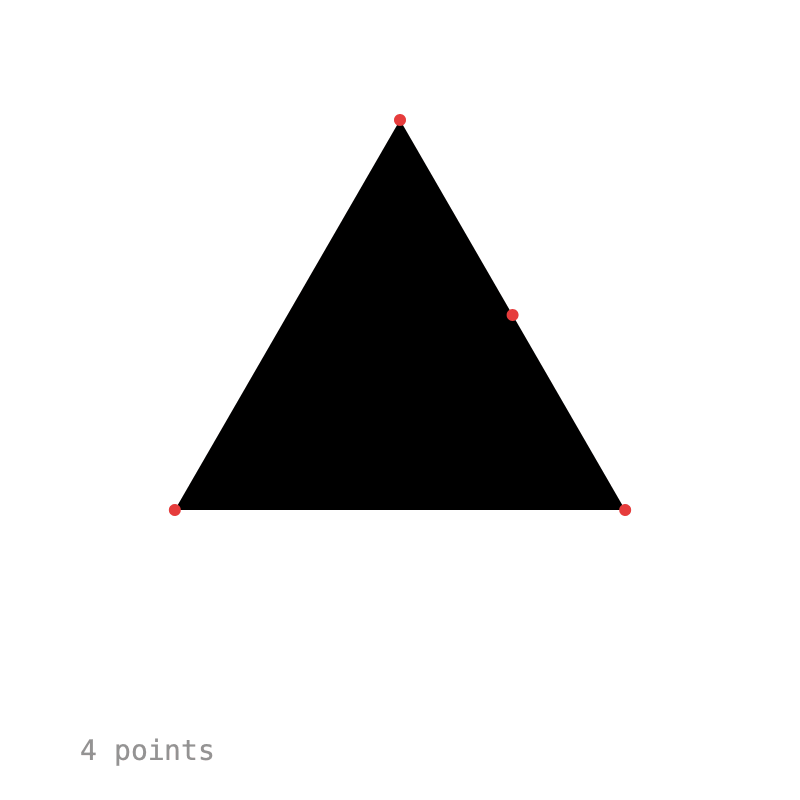
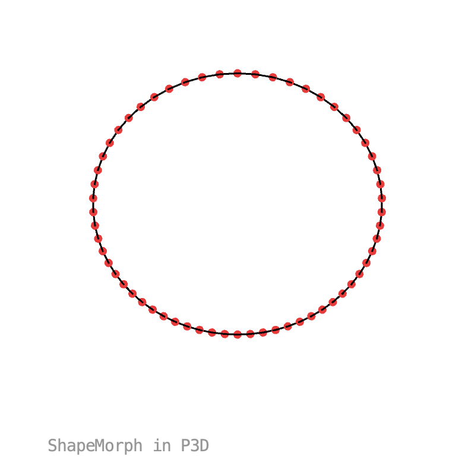
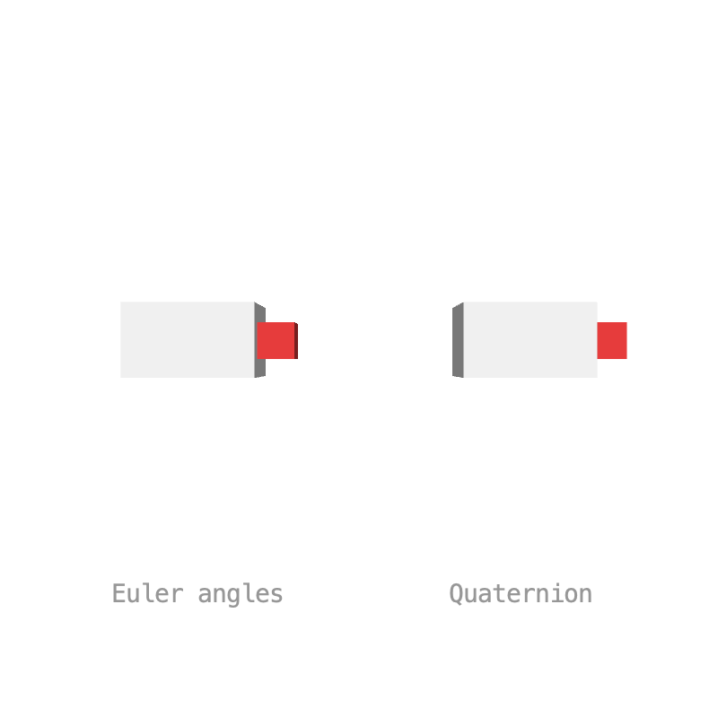

# 8. Types

How two values blend is decided by a **`Lerp`**. `Keyed.of()` picks one for you, but you can choose your own, write one as a lambda, or teach your own classes to blend themselves. Keyed also comes with two types for shapes and 3D rotations.

## Lerps

{ .sketch }

Pass a `Lerp` and a default value to the constructor to choose how values blend:

```java
shortWay = new Keyed<>(new AngleLerp(), 0f)
    .key(Key.at(0).setEasing(1 / 3f), radians(330))
    .key(Key.at(2).setEasing(1 / 3f), radians(30))
    .key(Key.at(4).setEasing(1 / 3f), radians(330));
```

The built-in lerps are in `ch.domizai.keyed.lerps`:

| Lerp | Blends |
|---|---|
| `FloatLerp`, `IntLerp`, `PVectorLerp` | numbers and vectors |
| `ColorLerp` | colors in RGB |
| `AngleLerp` | angles the short way round: from 330° to 30° it turns 60° forward, where `FloatLerp` turns 300° back |
| `StringLerp` | text, one character edit at a time |
| `BooleanLerp` | switches when the next key is reached |
| `StepLerp(threshold)` | any type; switches once the blend passes the threshold |

`Lerp` is a functional interface, so a lambda works too. This one blends colors in HSB, passing through the hues instead of gray:

```java
Lerp<Integer> hsbLerp = (a, b, d) -> lerpColor(a, b, d, HSB);
hsb = new Keyed<>(hsbLerp, 0)
    .key(0, color(255, 0, 0))
    .key(2, color(0, 255, 255))
    .key(4, color(255, 0, 0));
```

??? example "Full sketch: Lerps"
    ```java
    --8<-- "Types/Lerps/Lerps.pde"
    ```

## Your own types

{ .sketch }

A class that implements `Lerpable` knows how to blend itself, so `Keyed.of()` needs no `Lerp`. This `Transform` animates position, rotation and scale together, in one value:

```java
import ch.domizai.keyed.types.Lerpable;

public class Transform implements Lerpable<Transform> {
    public final float x, y, rotation, scale;
    ...
    @Override
    public Transform lerp(Transform b, float d) {
        float turn = ((b.rotation - rotation) % TWO_PI + TWO_PI + PI) % TWO_PI - PI;
        return new Transform(
            PApplet.lerp(x, b.x, d),
            PApplet.lerp(y, b.y, d),
            rotation + turn * d,
            PApplet.lerp(scale, b.scale, d));
    }
}
```

```java
transform = Keyed.of(new Transform(200, 200))
    .key(Key.at(0).setEasing(1 / 3f), new Transform(100, 120, 0, 1))
    .key(Key.at(1.3f).setEasing(1 / 3f), new Transform(300, 120, radians(120), 1.6f))
    ...
```

!!! tip
    Make your type immutable, like `Transform` with its `final` fields. Then `lerp()` can safely return shared instances.

??? example "Full sketch: CustomType"
    === "CustomType.pde"
        ```java
        --8<-- "Types/CustomType/CustomType.pde"
        ```
    === "Transform.pde"
        ```java
        --8<-- "Types/CustomType/Transform.pde"
        ```

## Shape morphing

{ .sketch }

`ShapeMorph` (in `ch.domizai.keyed.types`) is a closed polygon that blends point by point. Shapes may have different point counts: the shape with fewer points gets extra points on its longest edges, so outlines and corners stay sharp while it morphs.

```java
shape = Keyed.of(polygon(3, 130))
    .key(Key.at(0).setEasing(0.6f), polygon(3, 130))
    .key(Key.at(1).setEasing(0.6f), polygon(4, 120))
    .key(Key.at(2).setEasing(0.6f), star(5, 140, 60))
    .key(Key.at(3).setEasing(0.6f), polygon(40, 120))
    .key(Key.at(4).setEasing(0.6f), polygon(3, 130));
```

Create one from a list of `PVector`s with `new ShapeMorph(points)`. To draw it, call `vertices()` between `beginShape()` and `endShape()`:

```java
beginShape();
shape.value().vertices(this);
endShape(CLOSE);
```

!!! tip
    Start all shapes at the same angle, e.g. at the top, so they don't twist while morphing.

??? example "Full sketch: Morphing"
    ```java
    --8<-- "Types/Morphing/Morphing.pde"
    ```

## Shape morphing in 3D

{ .sketch }

`ShapeMorph` uses x, y and z, so outlines can morph in 3D too. With a 3D renderer, `vertices()` includes z. Here a circle turns into a wave, a trefoil knot and a triangle with only 3 points.

??? example "Full sketch: Morphing3D"
    ```java
    --8<-- "Types/Morphing3D/Morphing3D.pde"
    ```

## 3D rotation

{ .sketch }

Both boxes turn between the same two orientations. Blending three Euler angles one by one makes the left box tumble along the way. A `Quaternion` is a 3D rotation that blends along the shortest arc, so the right box turns straight there:

```java
quat = Keyed.of(Quaternion.identity())
    .key(Key.at(0).setEasing(1 / 3f), Quaternion.identity())
    .key(Key.at(1.5f).setEasing(1 / 3f), fromEuler(PI, 0, PI))
    .key(Key.at(3).setEasing(1 / 3f), Quaternion.identity());
```

Build quaternions with `Quaternion.fromAxisAngle(axis, angle)` and combine them with `mult()`. `apply(this)` rotates the matrix, like `rotate(angle, x, y, z)`:

```java
quat.value().apply(this);
```

??? example "Full sketch: Rotation3D"
    ```java
    --8<-- "Types/Rotation3D/Rotation3D.pde"
    ```

Next: [Composition](composition.md).
